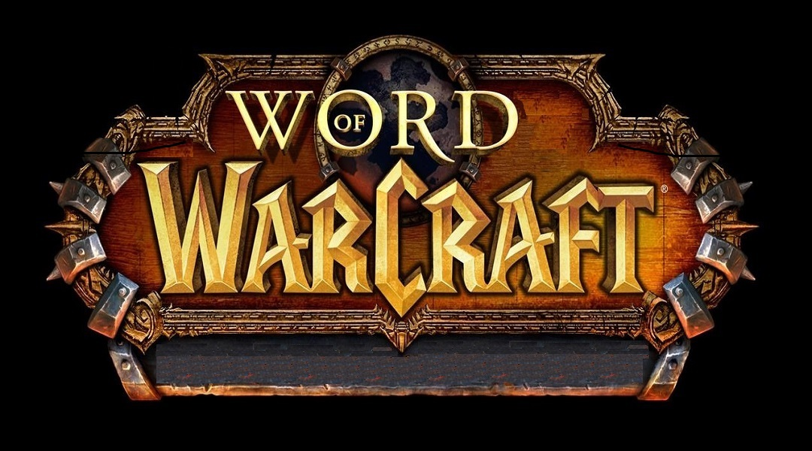

### Objetivo del juego
El principal objetivo del juego es que mientras el jugador vaya encontrando las letras para completar 
la palabra en inglés que aparece en la parte de arriba del juego corra del enemigo. Ahí mismo aparecen las vidas que tienes cuando éste te toca.

Este es un juego para personas que les interese aprender inglés mientras se divierte. 

### Clases principales y sus características
1. Muro
- MuroE
- MuroN

2. Personaje
- Jugador
- Enemigo

3. Botón
- Ayuda
- Créditos 
- Jugar

### Diagrama de clases
(https://plus.google.com/photos/113828127959402830080/album/6425319837927158817/6425319837735476658?authkey=CNKUmsDv9faz9AE)

(https://plus.google.com/photos/113828127959402830080/album/6425319837927158817/6425319839099449426?authkey=CNKUmsDv9faz9AE)

### Autor(es)
El autor(es) del proyecto son:
- Néstor Javier Méndez Gutiérrez
- Antonio de Jesús Noyola Ruiz
### Vídeo
(https://www.youtube.com/watch?v=i0rIihtdYG8)
### Materia(s)
- Programación Orientada a Objetos

### Semestre
- 2016-2017/II

### Universidad Autónoma de San Luis Potosí, 2017
